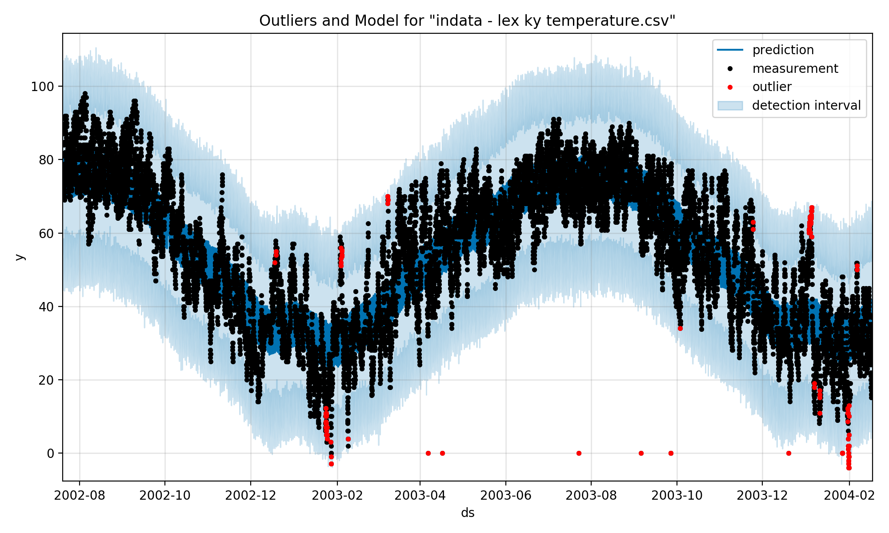

## badfomo

Basic Anomaly Detection from a Forecast that's Monovariate

## Huh?

Have a screenshot:

## TODO

- XXX data? weather data for lex ky, couple years, from mesonet at iowa state. https://mesonet.agron.iastate.edu/request/download.phtml?network=KY_ASOS
- XXX strategy? train on everything but 1 dayish window, then predict on that window, then compare points to forecast. i guess we could do this for every day on a rolling basis. Nope. We can just train on everything and forecast everything.
- XXX other data? office temp and humidity
- XXX Just build a forecast on the Lex data.
- XXX Chart the data vs. forecast bands.
- XXX Find outliers.
- XXX Nicer data model for outliers (stick a flag in the forecast).
- XXX Label the timestamps.
- XXX Highlight the outliers. https://github.com/facebook/prophet/blob/master/python/fbprophet/plot.py
- OOO Refactor in to a clean module. Some kind of object with update(), find_anomalies(), etc.
- OOO Improve performance?
- OOO Add in some knobs to tune it. https://facebook.github.io/prophet/docs/seasonality,_holiday_effects,_and_regressors.html

## Other Options

- https://github.com/linkedin/luminol
- http://scikit-learn.org/stable/modules/outlier_detection.html